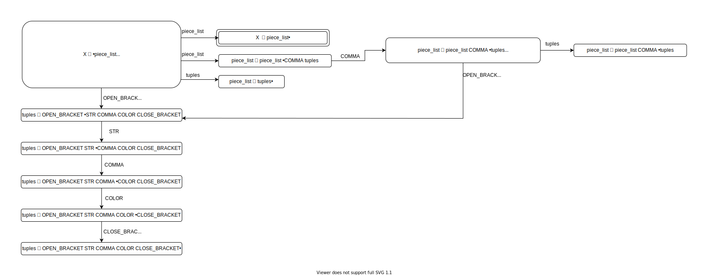
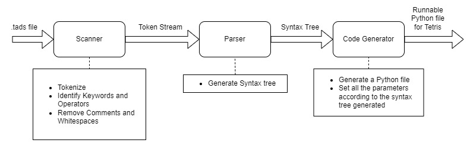
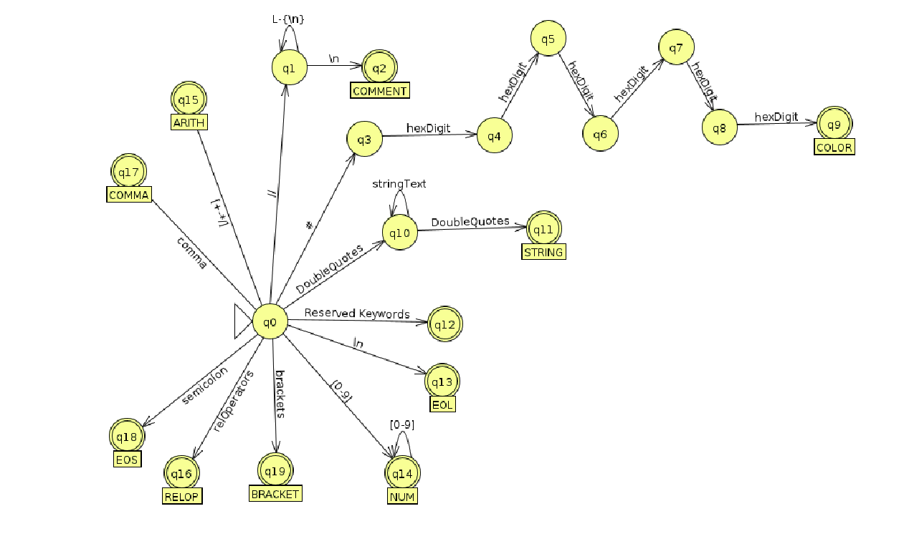

# Tetris Design in TADS Language

---

## STAGE 2
## Parser Design

- The interpreter translates from the TADS configuration language to a Python dictionary.
  The dictionary is used to set game specifications in the game engine.
- SLY has been used to design the scanner and parser.
  It follows LR Parsing, so does our designed parser.
- The parser performs the following:
  - Saves the configuration parameters into a Python dictionary as specified the programmer
  - Converts NUM string to int
  - Converts "piece_type - COLOR" pair to Python-interpretable tuple
  - Converts lists of numbers or tuples to Python-interpretable lists
  - Converts Hex code of COLOR to a length 3 list representing the RGB values
  - Converts ON/OFF bool types to 1/0 respectively
  - Counts the number of lines in the code that assist in indicating errors in the code
  - Error handling as described in "Challenges in Parser Design"

---

### Syntax Directed Translation Scheme



---

### Challenges in Parser Design

- Shift-reduce conflicts: Resolved by making the grammar unambiguous
- Manual Error Handling:
  - Check balanced bracketing
  - Check list size that are being assigned as values of DIMS, SCORING and PIECES
  - Validate types of Pieces set
  - Validate key bindings

---

### Test Cases

Test cases for parser are mentioned in `./tests/parser_test_cases.md` file. Details of the reasons and Input/Outputs for the same. 
---

### Makefile

In order to compile a `.tads` file, execute the following command:

```bash
$ make file=tetconf.tads
```

This will interpret the `.tads` file and start the executable tetris game.
---
---

## STAGE 1
## Scanner Design
---

## TADS Program Structure

The TADS language is a declarative language, that specifies how a tetris game needs to be configured. The TADS compiler will scan and parse a `.tads` file which will pick up configuration parameters and generate a python tetris game.

- Unix config files like paradigm is followed.
- There are python like assign statements but each statement has to be terminated by a “;”.

---

## Offered Primitives

- #### End of statement (EOS)

  Semicolon denotes the end of statement.
  Syntax example:

  ```
  sound = ON;
  ```
- #### Comma (COMMA)

  Delimiter
  Syntax example:

  ```
  pieces = [{"L", #008080}, {"I", #808080}, {"O", #800080}];
  ```
- #### Number (NUM)

  Regex is defined as:


  ```
  [0-9]+
  eg. 20 and 10 are "numbers"
  ```
- #### Strings (STR)

  Can only include alphabets (any case), underscores, digits, spaces and tabs.
  Strings are enclosed within double quotes `"` only.
  
  Syntax example:


  ```
  "A Str_ing  123"
  ```

- #### Booleans (BOOL)

  **ON** represents _true_, and **OFF** represents _false_
  
  Syntax example:

  ```
  ghost = ON;
  ```

- #### Comments (COMMENT)

  Single line or in-line comments:
  All characters following a `//` till end of the line is treated as a comment and hence ignored.
  
  Syntax example:

  ```
  sound = ON;      // This is an in-line comment
  ```

- #### Colour (COLOR)

  Hex code of length 6 represents colour.
  The hex code is followed by a '#' and consists of 0-9, a-z and A-Z characters.

  Syntax example:

  ```
  pieces = [{"T", #a4bE89}];
  ```

- #### End of Line (EOL)

  EOL is identified only to count the line number on which a segment of code is written. This is for help in throwing errors.
  `EOL: '\n'`

- #### Brackets (OPEN_BRACKET / CLOSE_BRACKET)

  - Opening Brackets: `(`, `{` and `[`
  - Closing Brackets: `)`, `}` and `]`

- #### Arithmetic Operations (ARITHOP, ASSIGN, RELOP)

  The operations recognised as arithmetic operations:
  - Add: `+`
  - Subtract: `-`
  - Multiply: `*`
  - Divide: `/`

- #### Assignment Operation (ASSIGN)

  - Assignment: `=`

- #### Relational Operations (RELOP)

  The operations recognised as relational operations
  - Less than: `<`
  - Greater than `>`
  - Less than or equal to: `<=`
  - Greater than or equal to: `>=`
  - Not equal to: `<>`

---

## Programmable Features

- ### Basic Settings


  - #### Board (DIMS)

    To specify rows, cols as dimensions of the game grid.
    If not specified, the default dimensions are taken as (20,10).
    Syntax example:


    ```
    board = [20,10];
    ```
  - #### Sound (SOUND)

    The Sound configurations can be toggled on or off. 0 for off, 1 for on.
    Syntax example:

    ```
    sound = ON;
    ```

- ### Pieces (PCS)

  - We use `I`, `O`, `T`, `L`, `J`, `S`, `Z` as default tetrominoes, with each type having specified default colors.
  - Pieces can be selected by the programmer from the default tetrominoes in the following format:
    `[{pieceName1, color1}, {pieceName2, color2}, ... ]`
    Each element is a pair with tetromino name and a color, defined in hex
    (6 digit hex, for instance `#008080` for teal).
    Example:

    ```
    pieces = [{"L", #008080}, {"I", #808080}, {"O", #800080}];
    // This defines 3 types of pieces to be included in the game each colored teel.
    ```
  - If programmer does not define pieces or defines `pieces = [];` then the default 7 are set with default colors.
  - If a color field is left blank then a default color is applied to it.
    Example: `pieces=[{"L",}];`

- ### Key Bindings (K_KEY)

  The actions which are available are:


  - rotate
  - go_left
  - go_right
  - soft_drop
  - hard_drop
  - pause

  Can be assigned to keys, for example:

  ```
  rotate = "K_UP"; 
  ```

  - The values specified should be the key names defined in [pygame docs](https://www.pygame.org/docs/).
  - If any keybinding is unspecified then the default key binding is used.
- ### Difficulty Settings


  - #### Speed (SPEED)

    Speed can be set to to an integer level from 1 to 10 inclusive.
    Syntax example,

    ```
    speed = 5;
    ```

  - #### Piece Generation Algorithm Bias (PGA_BIAS)

    The bias of the **piece generation algorithm** can be toggled on or off:


    - If the bias is **OFF**, all pieces are generated randomly with equal probability.
    - Otherwise if it is set (**ON**), pieces `O`, `I` shall be generated with low probability, `T`, `J`, `L` with higher probability and `S`, `Z` with the hightest probability.
    - Syntax example,
      ```
      pga_bias = ON;
      ```
  
  - #### Disco mode (DISCO_MODE)

    Disco mode can be toggled on or off:


    - **OFF**: Normal color scheme is followed where each type of block has a static color.
    - **ON**:  The color of all blocks and the grid frame all flash random colors each frame.

    Syntax example,

    ```
    disco_mode = OFF;
    ```
  - #### Ghost mode (GHOST_MODE)

    Ghost piece is the predicted position of the block in motion if it is dropped in its current column. It can be toggled **ON** or **OFF**.
    
    Syntax example,

    ```
    ghost_mode = ON;
    ```

- ### Scoring Levels (SCORING)

  The `scoring` is assigned as a list of integer values. The i$^{th}$ value of points are awarded for clearing i rows.

  Syntax example,

  ```
  scoring = [0, 40, 100, 300, 1200];
  ```

- ### Welcome message (OPENING_MSG)

  The text that is displayed when the game is launched.
  
  Syntax Example:

  ```
  opening_msg = "Welcome! Press any key to begin.";
  ```

- ### Ending message (ENDING_MSG)

  The text that is displayed when the game ends.
  
  Syntax Example:

  ```
  closing_msg = "Game over!";
  ```

---

---

## Pipeline Design



## Scanner Design

- The scanner performs the tasks of **tokenising**.
  - Identifies keywords, such as board, pieces
  - Identifies data types, such as strings, numbers, color
  - Some pre-processor tasks such as discarding comments, whitespaces (tabs and spaces)
  - Identifies new lines
- The language is strict in terms of token definitions and allowed character sets in a data type.
- There is no overlap of regex between any of the tokens. The keywords in themselves may have slight overlap, handled by our scanning library itself. We as scanner designers need not worry about it.
- Operators are recognised for future extendability.

#### Transition Diagram




#### Test Plan

1. To scan each type of statement separately with a few edgecases.
2. To scan a sample `.tads` file and then check tokenisation.

Testcases are defined in `/tests/scanner_test_cases.md`

---
---

## Division of Labour between Scanner and Parser

- The scanner only performs tokenisation wherein it identifies keywords, datatypes and performs some pre-processor tasks as described in the `Scanner Design` section.
- The parser handles the Logical flow, performs the Arithmetic operations and performs Error Handling.

---

---
